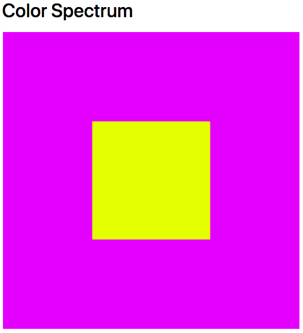

# Colors that compliment each other

In P5, the most popular `colorMode(mode,[max]);` || `colorMode(mode, max1, max2, max3, [maxA]);` is HSB.

### H
The Hue, the specific color

### S
The saturation, the amount of color or the _intensity_

### B
The Brightness, how bold the color is.

***

# Using the P5 Reference
MouseX and MouseY are predefined variables used in P5.
They can be very useful, and are gonna be used a lot throughout this module, so understand them _properly_

### What does P5 have to say?

The system variable mouseX always contains the current horizontal position of the mouse, relative to (0, 0) of the canvas. If touch is used instead of mouse input, mouseX will hold the x value of the most recent touch point.

### What's it look like in the Code?
  ```javascript
  rect(0, 0, mouseX, mouseX);
  ```
  Syntax for rectangle: ( X Location, Y Location, Width of Rect, Height of Rect);

___

# What does it look like on the Screen?

