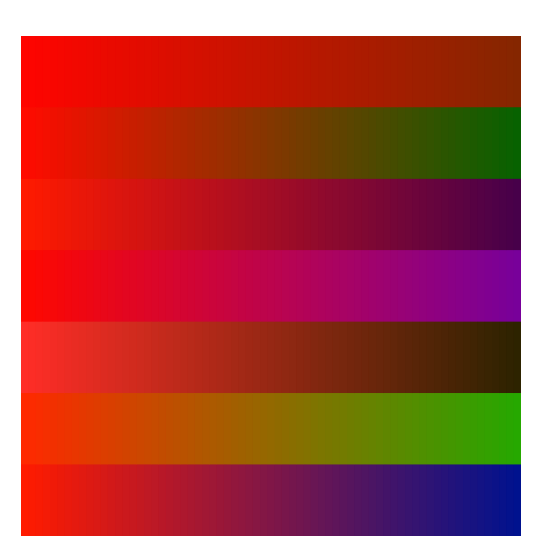

# Color Interpolation

### What is a Color Object?

`colorLeft[];`
An array in P5 takes so myColor = color(123, 123, 35);

___
## ShakeColor();
`shakeColor()` will generate the random colors needed.

### Using the P5 Reference
Vertexes need to be used to make Triangles and hence, make circles

### What does it look like on the Screen?

