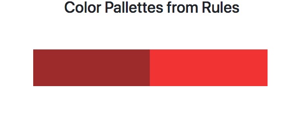
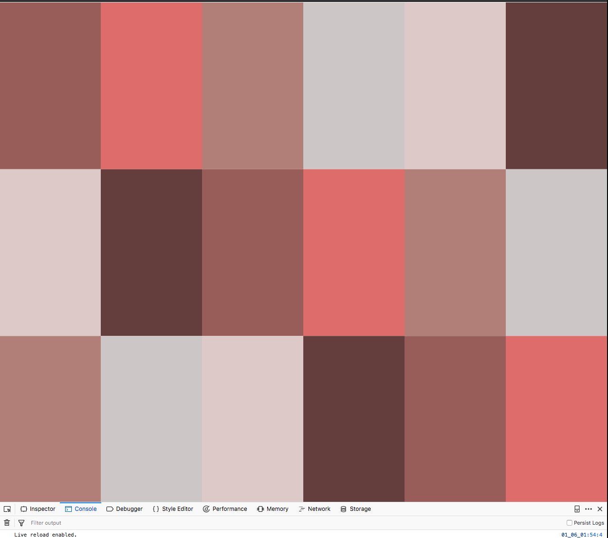
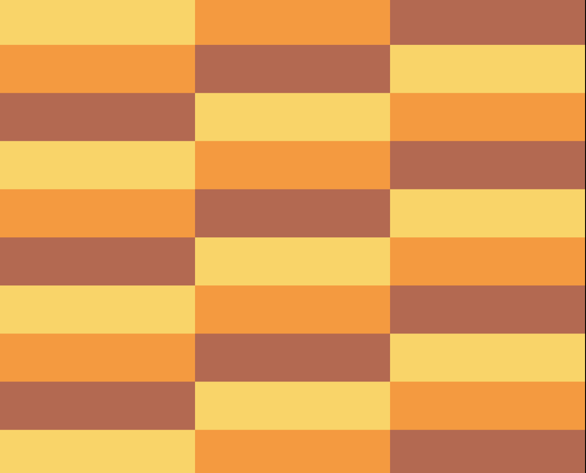

# Color Pallettes with Rules

## Step One

## What are we trying to achieve?
* * *
## Fragmentation and randomness in patterns.
* * *
-   xWidth = Random width of each tile to create randomness
-   an array of HSB Values (to allow for random H, S and B to be set)
-   colorCount to alternate between 2 'rules' or two ColorObjects
```javascript
for (i = 0; i < colorCount; i++) {
  if (i % 2 == 0) {
    hueValue[i] = random(50, 150);
    satValue[i] = 150;
    brightValue[i] = random(20, 40);
  } else {
    hueValue[i] = 100;
    satValue[i] = random(40,80);
    brightValue[i] = random(60, 100);
  }
}

for( i = 0; i < 5; i++) {
  var xWidth = random(20, 1000);
  rect(20,20, xWidth, 75);
  fill(hueValue[i], satValue[i], brightValue[i]);
}
```

### What does it look like on the screen, at this point?


## Step Two

```javascript
var mapX = int(map(mX, 0, width, 1, 50));
// when the X value of the Map the offset stops working?
// Don't understand
var mapY = int(map(mY, 0, height, 1, 10));
var tileWidth = width / mapX;
var tileHeight = height / mapY;

for (var gridY = 0; gridY < 10; gridY++) {
  for (var gridX = 0; gridX < 50; gridX++) {
    var Xposition = tileWidth * gridX;
    var Yposition = tileHeight * gridY;

    var index = counter % mapX;

    // get component color values
    fill(hueValue[index], satValue[index], brightValue[index]);
    rect(Xposition, Yposition, tileWidth, tileHeight);
    counter++;
  }
}
}
```

## What does it look like on Screen?

___


### Very Seventies

